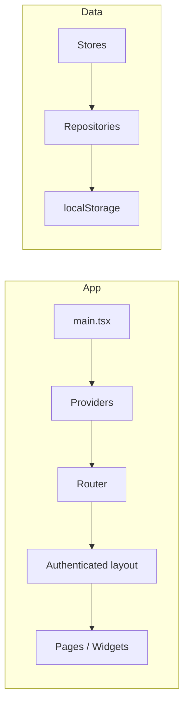

# Structura ERP (Factory OS)

A factory-floor management web app for machines, jobs, projects, clients, inventory, and operator terminals. Spanish UI; PIN-based auth; data in `localStorage` (no backend required).

---

## The idea of the project

**Purpose:** Give small/medium manufacturing plants a single web app to run the floor: see machines and jobs, manage projects and orders, track inventory and clients, and let operators use a machine-focused terminal—without needing a backend or database.

**Audience:** Plant admins, supervisors, and operators; Spanish-speaking UI.

**Design choices:** PIN-based login (fast, works on shared devices); all data in the browser (localStorage) so it runs offline-capable and backend-free; dashboard + sidebar + operator terminal as the main workflows.

---

## What you can do

- **Log in** with a PIN (admin, supervisor, or operator).
- **Dashboard:** See loading schedule, alerts (e.g. ready for delivery), machine grid with status/OEE, and today’s events; click a machine to open its operator terminal, or go to clients/settings.
- **Operator terminal:** Open by machine (e.g. `/operator/M-01`); work the job queue and machine controls for that machine.
- **Proyectos (Projects):** Manage projects and related data.
- **Producción (Orders):** Manage production orders.
- **Stock (Inventory):** Manage inventory.
- **Clientes (Clients):** Manage clients.
- **Ajustes (Settings):** Configure general settings and machines (via tab param).
- **Log out** from the sidebar.

If you set `GEMINI_API_KEY` in your environment, an optional AI assistant is available.

---

## Tech stack

- **Runtime / build:** React 19, TypeScript, Vite 6
- **Routing:** TanStack Router (code-based route tree)
- **State:** Zustand (with persist for user/session)
- **UI:** Tailwind (via CDN in [index.html](index.html)), Lucide icons, Recharts
- **Optional:** `@google/genai` for AI assistant (needs `GEMINI_API_KEY` in env)

---

## Project structure

- **src/app** — Entry ([main.tsx](src/app/main.tsx)), [App](src/app/App.tsx), [providers](src/app/providers/index.tsx) (Router, ErrorBoundary, Toast, OfflineBanner, StoreProvider), [routes](src/app/routes/) (root, login, authenticated layout, lazy page routes), global styles
- **src/entities** — Domain stores + repositories (e.g. user, machine, job, project, client, inventory, alert, event, message, projectAccessory). Each has `api/` (repository), `model/` (Zustand store), and sometimes `ui/`
- **src/features** — Auth (PIN + PinPad), AI assistant (Gemini), job-management (sequencing), logistics-messaging (alerts)
- **src/pages** — Route-level screens: Login, Dashboard, Operator, Projects, Orders, Inventory, Clients, Settings
- **src/widgets** — Composed UI: sidebar, machine-dashboard, loading-schedule, alerts-panel, event-feed, job-queue, etc.
- **src/shared** — API layer ([storage](src/shared/api/storage.ts), [localStorageRepository](src/shared/api/localStorageRepository.ts), [config](src/shared/api/config.ts)), types, hooks, shared UI (Button, Card, Modal, Spinner, etc.), constants and [seeds](src/shared/constants/seeds.ts)



---

## How it works (technical)

Below is how the app achieves the flows described in "What you can do".

### Authentication

- Login at `/login` via PIN pad ([LoginPage](src/pages/login/ui/LoginPage.tsx) + [useAuth](src/features/auth/model/useAuth.ts)).
- Users come from [user store](src/entities/user/model/userStore.ts) (persisted); demo users in [seeds](src/shared/constants/seeds.ts) (e.g. Admin `1234`, operators `0000`/`1111`/`2222`).
- Roles: `ADMIN`, `OPERATOR`, `SUPERVISOR` ([user.types](src/shared/types/user.types.ts)).
- [authenticated.tsx](src/app/routes/authenticated.tsx) runs `beforeLoad` (redirect to `/login` if no `currentUser`), then renders Sidebar + main content for all authenticated users.

### Data

- All app data is in **localStorage** under a single key ([storage.ts](src/shared/api/storage.ts), [constants/storage.ts](src/shared/constants/storage.ts)).
- Entities use **repositories** (e.g. [userRepository](src/entities/user/api/userRepository.ts)) that read/write via shared [localStorageRepository](src/shared/api/localStorageRepository.ts) / storage.
- On app load, [StoreProvider](src/app/providers/StoreProvider.tsx) hydrates all entity stores (machines, users, jobs, projects, clients, inventory, alerts, messages, events, projectAccessories); a loading screen is shown until hydration completes.

### Routing

- [routeTree.ts](src/app/routes/routeTree.ts): root has children `login` and authenticated layout; authenticated layout has children dashboard (index `/`), `operator/$machineId`, projects, orders, inventory, clients, settings.
- Dashboard at `/`; operator terminal at `/operator` or `/operator/:machineId`; settings use a `$tab` param (e.g. general, machines).

### Main flows

- **Dashboard:** [DashboardPage](src/pages/dashboard/ui/DashboardPage.tsx) shows LoadingSchedule, AlertsPanel, MachineDashboard, EventFeed; clicks can navigate to operator (machine), clients, or settings.
- **Operator:** [OperatorPage](src/pages/operator/ui/OperatorPage.tsx) is the machine terminal (job queue, machine controls, etc.); route param selects machine.
- **Sidebar:** [Sidebar](src/widgets/sidebar/ui/Sidebar.tsx) links to Dashboard, Terminal (operator), Proyectos, Producción, Stock, Clientes, Ajustes, and Logout.

---

## Getting started

**Prerequisites:** Node.js 18+.

```bash
npm install
npm run dev
```

- **Dev:** `npm run dev` (Vite; default port 3000, host `0.0.0.0` per [vite.config.ts](vite.config.ts))
- **Build:** `npm run build`
- **Preview:** `npm run preview`

**Optional:** Create a `.env` (or `.env.local`) with `GEMINI_API_KEY=...` for the AI assistant; Vite exposes it via [vite.config.ts](vite.config.ts) `define`.

---

## Testing

- **Unit / integration:** `npm run test` (Vitest); [vitest.config.ts](vitest.config.ts); tests in `src` (e.g. `*.test.ts`, `*.test.tsx`) and [test/setup.ts](src/test/setup.ts).
- **E2E:** `npm run test:e2e` (Playwright); [playwright.config.ts](playwright.config.ts); specs in [e2e/](e2e/) (e.g. auth, operator flow).

---

## Demo credentials

| Role     | PIN   |
| -------- | ----- |
| Admin    | `1234` |
| Operator | `0000`, `1111`, `2222` |

---

## License

Private.
